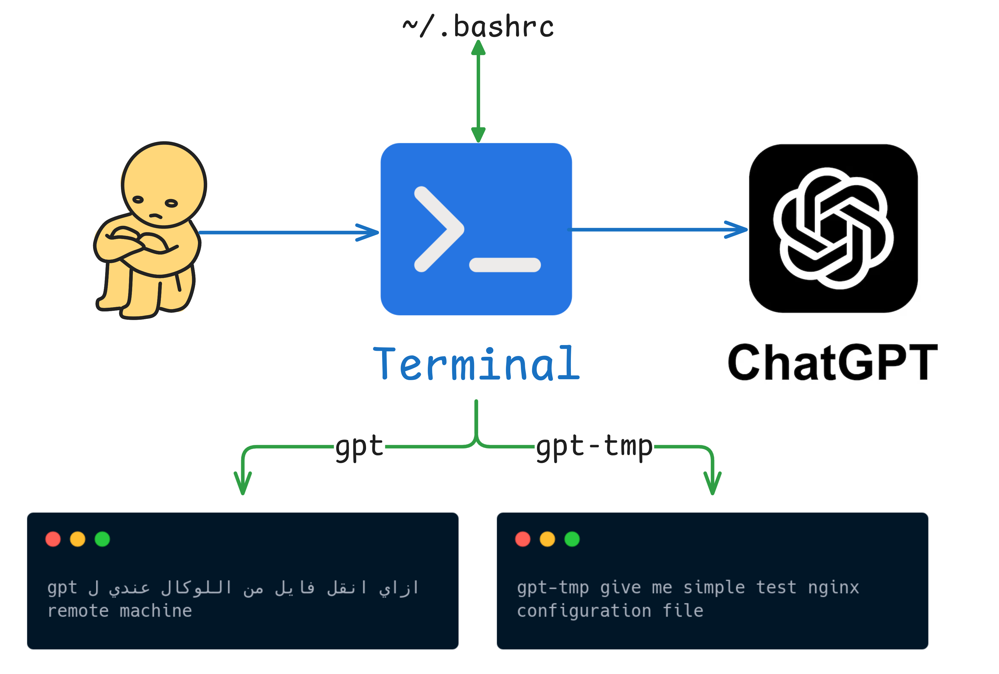

#  ChatGPT-Terminal-Workaround 

<p align="center">
  
</p>


كنت قاعد شغال في ال Terminal وبتسائل ليه كل مرة عاوز أسال Chatgpt لازم افتح المتصفح واخش عالموقع واكتب السؤال بإيدي؟
وف نفس الوقت انا مش عاوز ادفع ل api-key quota
طب بما اننا مؤمنين بـ

<p align="center">
<b>If you’re doing it more than twice .. automate it.</b>
</p>

خلينا نعمل workaround كدا حوالين الموضوع ونشوف حليت الموضوع دة ازاي.

---

## الفكرة:
اني هكتب كلمة `gpt` وبعدها هكتب اي حاجة انا محتاج اسال عنها واضغط enter ..  
المتصفح يفتح، السؤال متاخد Copy، كل اللي عليك تعمله Ctrl + V و Enter وخلاص وصلت للإجابة.

مثلا:
```bash
gpt give me simple test nginx configuration file
````

او حتي لو كلام عربي وداخل فيه انجليزي زي كدا:

```bash
gpt ازاي انقل فايل من اللوكال عندي ل remote machine
```

---

## شرح ال script اللى هنعمله:

```bash
# Choose your browser
#### google-chrome
#### firefox
#### brave
export GPT_BROWSER="firefox"

gpt_open() {
  url="$1"
  "$GPT_BROWSER" --new-tab "$url" >/dev/null 2>&1 &
}

alias gpt='f(){ echo "$*" | xclip -selection clipboard; gpt_open "https://chat.openai.com/"; }; f'
alias gpt-temp='f(){ echo "$*" | xclip -selection clipboard; gpt_open "https://chat.openai.com/?temporary-chat=true"; }; f'
```

<p dir="rtl">
كلمة gpt بتعمل الآتي:
  
١. بتاخد السؤال copy فى ال clipboard

٢. وكمان بتستدعي Function اسمها `gpt_open` فـال script وظيفتها تفتحلك المتصفح وبتعرف نوع المتصفح من variable انت معرفهولها فوق بنوع المتصفح سواء firefox او brave او chrome.

٣. وتقدر كمان تستخدم `gpt-temp` بدل `gpt` علشان لو حابب تفتح صفحة temporary مش new chat.

</p>

---

## Installation Steps

### 1. Install clipboard tool

```bash
sudo apt install xclip -y
```

### 2. Add the script to ~/.bashrc

```bash
vim ~/.bashrc
```

**Copy & Paste & Save:**

```bash
# Choose your browser
#### google-chrome
#### firefox
#### brave
export GPT_BROWSER="firefox"

gpt_open() {
  url="$1"
  "$GPT_BROWSER" --new-tab "$url" >/dev/null 2>&1 &
}

alias gpt='f(){ echo "$*" | xclip -selection clipboard; gpt_open "https://chat.openai.com/"; }; f'
alias gpt-temp='f(){ echo "$*" | xclip -selection clipboard; gpt_open "https://chat.openai.com/?temporary-chat=true"; }; f'
```

### 3. Apply the changes

```bash
source ~/.bashrc
```

### 4. Test the aliases

```bash
gpt how to copy file to remote server
```

```bash
gpt-temp how compress file in ubuntu
```

---

<p align="center">
<b>Keep automating. Keep creating.</b>
</p>
